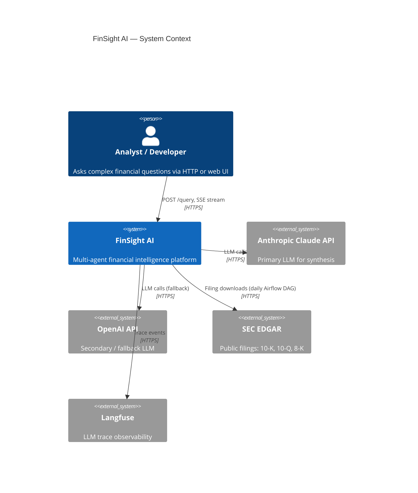
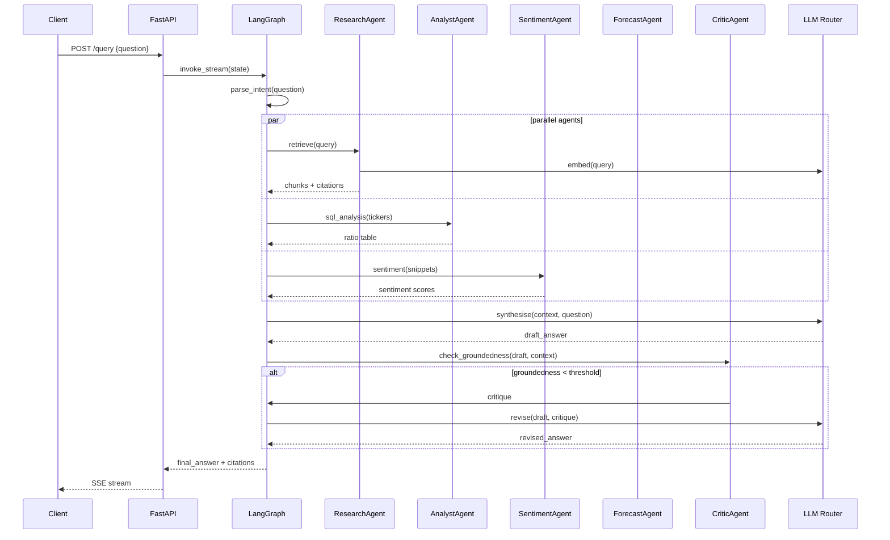

# FinSight AI — Architecture

## System Context



---

## Component Responsibilities

| Component | Responsibility |
|---|---|
| `api/` | FastAPI entrypoint, routing, middleware (request-id, logging, rate-limit) |
| `agents/graph.py` | LangGraph orchestrator: routes query intent, invokes agents, streams output |
| `agents/research.py` | Calls hybrid retriever, synthesises grounded answer with citations |
| `agents/analyst.py` | Runs SQL queries over structured financials, produces ratio analysis |
| `agents/sentiment.py` | Calls FinBERT ML service, aggregates sentiment scores |
| `agents/forecasting.py` | Calls Prophet ML service, returns forecast with confidence intervals |
| `agents/critic.py` | Checks groundedness against retrieved context; loops up to N times |
| `llm/client.py` | `LLMClient` protocol + Anthropic / OpenAI implementations |
| `llm/router.py` | Routes tasks to cheap/premium models based on `TaskComplexity` enum |
| `llm/cache.py` | Redis semantic cache: embed → cosine search → return hit or miss |
| `llm/guardrails.py` | Prompt-injection detection, PII redaction, financial disclaimer injection |
| `rag/chunker.py` | Hierarchical chunking respecting 10-K section boundaries |
| `rag/ingest.py` | chunk → embed → upsert into Qdrant with rich metadata |
| `rag/retriever.py` | BM25 (Postgres tsvector) + dense (Qdrant) → RRF → rerank → top-k |
| `rag/stores.py` | Qdrant client wrapper + Postgres async wrapper |
| `ingestion/sec_edgar.py` | Async SEC EDGAR fetcher; idempotent by accession number |
| `ml/sentiment_service.py` | FinBERT FastAPI sub-app: `/predict` for sentiment |
| `ml/forecast_service.py` | Prophet FastAPI sub-app: `/predict` for price/revenue forecast |
| `ml/anomaly_service.py` | Isolation forest FastAPI sub-app: `/predict` for volume anomalies |
| `obs/tracing.py` | OTel tracer init + Langfuse integration |
| `obs/metrics.py` | Prometheus registry, counters, histograms |
| `eval/` | RAGAS runner + LLM-as-judge harness |

---

## Data Flow — Sample Query

```
User: "Compare META vs GOOGL margin trajectories post-2022"

1. POST /query → middleware (request-id, rate-limit check)
2. LLM guardrails check (injection / PII scan)
3. Redis semantic cache lookup (embed query → cosine search)
   ├── HIT  → return cached response
   └── MISS → continue
4. LangGraph orchestrator parses intent
   → spawns: research_agent, analyst_agent, sentiment_agent
5. research_agent: hybrid retriever
   a. BM25 on Postgres tsvector (META + GOOGL 10-K sections)
   b. Dense search on Qdrant
   c. RRF fusion
   d. Cross-encoder rerank → top-5 chunks
6. analyst_agent: SQL queries on structured financials table
7. sentiment_agent: FinBERT over recent earnings call snippets
8. LLM synthesis (premium model) → draft answer + citations
9. critic_agent: groundedness check → loop if fails (max 3)
10. Write to Redis cache
11. SSE stream tokens to client + final citations metadata
```

---

## Agent Graph — Sequence Diagram



---

## Key Tradeoffs

| Decision | Chosen | Alternative | Why |
|---|---|---|---|
| Agent framework | LangGraph | LangChain agents | Explicit graph = inspectable state, fine-grained control over loops |
| Retrieval | Hybrid BM25 + dense | Pure dense | BM25 captures exact ticker/section matches dense vectors miss |
| LLM abstraction | Protocol + impls | LangChain LLMs | Zero extra abstraction layer; trivial to swap providers |
| Streaming | SSE | WebSocket | Simpler client; no bidirectional comms needed |
| Local Kafka | Redpanda | Full Kafka | Same API, 10× lighter for dev; production can swap to Confluent |
| Embeddings | bge-large-en-v1.5 | OpenAI ada-002 | Runs locally (no token cost per ingest), MTEB-leading open model |
