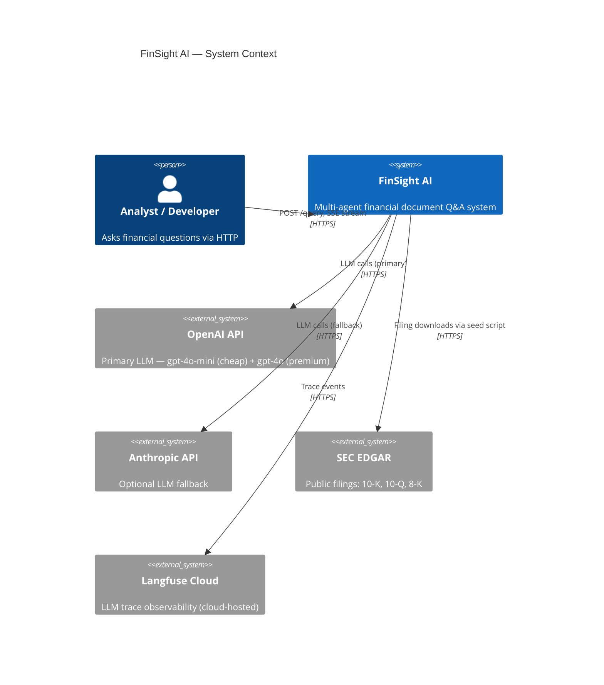
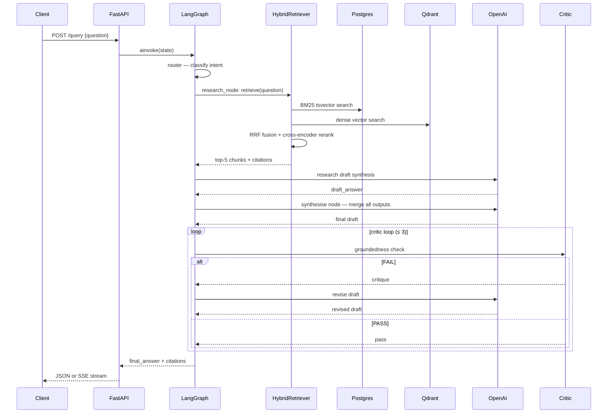

# FinSight AI — Architecture

## System Context



---

## Component Responsibilities

| Component | Responsibility |
|---|---|
| `api/` | FastAPI entrypoint, routing, middleware (request-id, logging, rate-limit) |
| `agents/graph.py` | LangGraph orchestrator: router → parallel agents → synthesise → critic |
| `agents/research.py` | Hybrid retrieval + LLM draft synthesis with inline citations |
| `agents/analyst.py` | SQL queries over structured financials (stub in Phase 1) |
| `agents/sentiment.py` | Calls FinBERT ML service (stub in Phase 1) |
| `agents/forecasting.py` | Calls Prophet ML service (stub in Phase 1) |
| `agents/critic.py` | PASS/FAIL groundedness check; loops back to synthesise ≤ 3 times |
| `llm/client.py` | `LLMClient` protocol + OpenAI / Anthropic implementations |
| `llm/router.py` | Routes tasks to cheap/premium model based on `TaskComplexity` enum |
| `llm/cache.py` | Redis semantic cache: embed → cosine search → return hit or miss |
| `llm/guardrails.py` | Prompt-injection detection, PII redaction, financial disclaimer injection |
| `rag/chunker.py` | Hierarchical chunking respecting 10-K section boundaries |
| `rag/ingest.py` | chunk → embed → upsert into Qdrant with rich metadata |
| `rag/retriever.py` | BM25 (Postgres tsvector) + dense (Qdrant) → RRF → rerank → top-k |
| `rag/stores.py` | Qdrant client wrapper + Postgres async wrapper |
| `ingestion/sec_edgar.py` | Async SEC EDGAR fetcher; idempotent by accession number |
| `ml/sentiment_service.py` | FinBERT FastAPI sub-app: `/predict` endpoint |
| `ml/forecast_service.py` | Prophet FastAPI sub-app: `/predict` endpoint |
| `ml/anomaly_service.py` | Isolation forest sub-app: `/predict` endpoint |
| `obs/tracing.py` | OTel tracer init + Langfuse Cloud integration |
| `obs/metrics.py` | Prometheus registry, counters, histograms |
| `eval/` | RAGAS runner + LLM-as-judge harness (built; not yet run live) |

---

## Data Flow — Sample Query

```
User: "What were Apple's main revenue drivers in fiscal 2023?"

1. POST /query → middleware (request-id, rate-limit check)
2. LLM guardrails (injection / PII scan)
3. Redis semantic cache lookup (embed query → cosine similarity)
   ├── HIT  → return cached response
   └── MISS → continue to graph
4. LangGraph: router node classifies intent (factual / analysis / sentiment / forecast)
5. agents node (parallel asyncio.gather):
   a. research_node:
      i.  BM25 search on Postgres tsvector
      ii. Dense search on Qdrant (query embedded via bge-large-en-v1.5)
      iii.RRF fusion (k=60)
      iv. Cross-encoder rerank (bge-reranker-large) → top-5 chunks
      v.  LLM draft synthesis with [ticker:section] citations (OpenAI gpt-4o)
   b. analyst_node: SQL ratio queries (Phase 1: returns empty if no structured data)
   c. sentiment_node: FinBERT via ML service (Phase 1: returns empty if no snippets)
   d. forecasting_node: Prophet via ML service (Phase 1: returns empty)
6. synthesise node: premium LLM merges all outputs into final draft answer
7. critic node: cheap LLM checks groundedness against retrieved context
   └── FAIL (and iterations < 3) → loop back to synthesise
   └── PASS or iteration 3 → END
8. Write to Redis semantic cache
9. Return answer + citations (SSE stream or JSON)
```

**Idempotent ingestion:** Each filing is processed at most once. The accession
number is written to a `processed_filings` marker only after the full chunk
upsert into both Postgres and Qdrant succeeds. A restart mid-ingest replays
from the last unfinished filing.

---

## Agent Graph — Sequence Diagram



---

## Key Tradeoffs

| Decision | Chosen | Alternative | Why |
|---|---|---|---|
| Agent framework | LangGraph | Plain asyncio | Explicit graph topology, built-in state, conditional loops |
| Retrieval | Hybrid BM25 + dense | Pure dense | BM25 captures exact ticker/section matches that dense vectors miss |
| LLM provider | OpenAI (primary) | Anthropic (primary) | gpt-4o-mini offers the best cost/quality ratio for cheap-tier tasks |
| LLM abstraction | Protocol + impls | LangChain LLMs | Zero extra abstraction; trivial to swap providers |
| Streaming | SSE | WebSocket | Simpler client; no bidirectional comms needed |
| Local Kafka | Redpanda | Full Kafka | Same API, much lighter for dev; production can swap to Confluent |
| Embeddings | bge-large-en-v1.5 | OpenAI ada-002 | Self-hosted (no per-query cost), competitive MTEB scores |
| Langfuse | Cloud-hosted | Self-hosted in compose | Removes one stateful service from local stack; see ADR-005 |
| Worker count | 1 uvicorn worker | Multiple workers | 1.3 GB model loaded per worker; single worker keeps memory bounded |

---

## Known Constraints

These are real limitations of the Phase 1 implementation, documented so
readers understand the scope of what was shipped.

| Constraint | Detail |
|---|---|
| CPU embedding inside Docker | Docker on macOS has no Metal/MPS access; all embedding inference runs on CPU. Query latency is ~60 s cold. See ADR-003. |
| Single uvicorn worker | `--workers 1` is intentional: the 1.3 GB bge-large model is loaded once at startup. Multiple workers would multiply memory consumption. |
| Model loading window at startup | The API is not ready to serve requests for ~15–30 s after container start while models load. The healthcheck `start_period: 30s` accounts for this. |
| 2 of 10 tickers indexed | AAPL and MSFT only (~3,400 chunks). CPU embedding throughput made full ingestion impractical in Phase 1. See ADR-004. |
| Eval harness not run live | RAGAS + LLM-judge harness is built and tested in unit tests; a live evaluation run with published scores is deferred to Phase 2. |
| Analyst/sentiment/forecast agents | These nodes run in the graph but return empty results for most queries in Phase 1, as the structured financial data and news ingestion pipelines are not seeded. |
