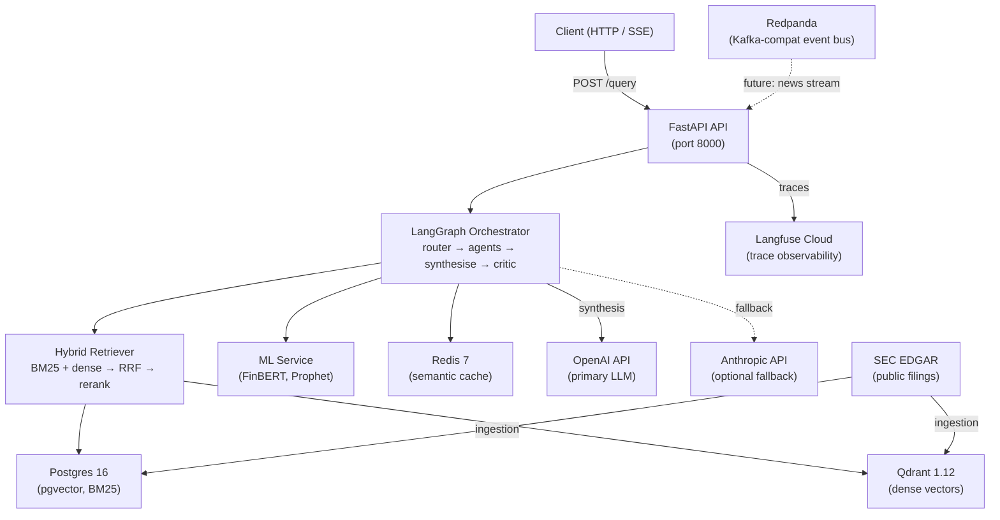

# FinSight AI

FinSight AI is a portfolio project demonstrating production-engineering
patterns applied to financial document Q&A. It retrieves relevant SEC
filing sections via hybrid RAG (BM25 + dense + RRF + cross-encoder
reranking), routes queries through a multi-agent LangGraph pipeline,
and synthesises cited answers using an LLM. The goal is a working,
observable, evaluable system — not a polished product.

---

## Current Status

**Phase 1 complete** — 2026-05-31. See [ROADMAP.md](ROADMAP.md) for what's next.

### Working
- 6-service docker-compose stack (Postgres/pgvector, Qdrant, Redis, Redpanda, API, ML)
- SEC EDGAR ingestion pipeline with idempotent upsert
- Hybrid retrieval: BM25 (Postgres tsvector) + dense (Qdrant) → RRF → cross-encoder rerank
- Multi-agent LangGraph graph: router → parallel agents → synthesise → critic (loop ≤ 3)
- RAGAS + LLM-judge evaluation harness (built; not yet run against live system)
- Observability: structured logging, OTel tracing, Prometheus metrics, cloud Langfuse

### Partial
- Single-query demo works end-to-end for AAPL queries (~60 s on CPU inside Docker);
  final LLM synthesis requires an OpenAI key with active billing credit
- Analyst, sentiment, and forecasting agent nodes exist but are not exercised in the
  seed dataset — Phase 1 only validates the research + critic path

### Deferred
- Full 10-ticker ingestion (blocked on CPU embedding throughput inside Docker)
- End-to-end synthesis demo without billing credit dependency
- Live evaluation run with published RAGAS scores
- Web UI, rate-limit dashboard, cost metrics

---

## Quickstart

```bash
# 1. Configure environment
cp .env.example .env
# Edit .env — set OPENAI_API_KEY (required) and SEC_EDGAR_USER_AGENT

# 2. Start infrastructure
make up

# 3. Run database migrations
make migrate

# 4. Seed AAPL + MSFT (10–20 min on CPU; uses MPS automatically if on Apple Silicon host)
make ingest

# 5. Query
curl -X POST http://localhost:8000/api/v1/query \
  -H "Content-Type: application/json" \
  -d '{"question": "What were Apple's main revenue drivers in fiscal 2023?", "stream": false}'
```

See [docs/runbooks/local-setup.md](docs/runbooks/local-setup.md) for a full walkthrough
including prerequisites, expected timings, and troubleshooting.

---

## Architecture



See [ARCHITECTURE.md](ARCHITECTURE.md) for component breakdown and sequence diagrams.

---

## What This Project Demonstrates

- **Multi-agent orchestration** via LangGraph with explicit state, conditional loops, and
  parallel agent execution
- **Hybrid RAG** combining lexical (BM25/tsvector) and semantic (dense vectors) retrieval,
  fused with Reciprocal Rank Fusion and cross-encoder reranking
- **Tiered LLM routing** — cheap model for classification, premium model for synthesis
- **Semantic caching** in Redis to avoid redundant LLM calls on similar queries
- **Idempotent ingestion** pipeline with per-filing deduplication against SEC EDGAR
- **Production observability** stack: structured JSON logging, OTel traces → Langfuse,
  Prometheus counters/histograms
- **Evaluation harness** with RAGAS metrics and an LLM-as-judge groundedness check
- **Self-hosted inference** — embedding and reranking run locally, no per-query API cost

---

## Tech Stack

| Component | Technology | Role |
|---|---|---|
| API | FastAPI 0.115, uvicorn (1 worker) | HTTP entrypoint, SSE streaming |
| Agents | LangGraph 0.2 | Multi-agent orchestration |
| Primary LLM | OpenAI gpt-4o-mini / gpt-4o | Cheap classification + premium synthesis |
| Optional LLM | Anthropic claude-haiku / claude-sonnet | Fallback provider |
| Embeddings | BAAI/bge-large-en-v1.5 (1024-dim) | Self-hosted dense retrieval |
| Reranker | BAAI/bge-reranker-large | Cross-encoder reranking |
| Vector DB | Qdrant 1.12 | Dense vector search |
| Relational DB | Postgres 16 + pgvector | BM25 tsvector, structured data |
| Cache | Redis 7 | Semantic cache, rate limiting |
| Streaming | Redpanda (Kafka-compat) | Event bus (future news stream) |
| Observability | structlog, OTel, Prometheus, Langfuse Cloud | Logging, tracing, metrics |
| Eval | RAGAS 0.2, LLM-as-judge | Retrieval + generation quality |
| ML services | FinBERT, Prophet, scikit-learn isolation forest | Sentiment, forecast, anomaly |
| Packaging | Python 3.11, uv | Dependency management |

---

## Indexed Data

- **Tickers:** AAPL, MSFT (2 of 10 originally planned)
- **Volume:** ~3,400 chunks in Qdrant
- **Source:** 10-K and 10-Q filings from SEC EDGAR
- **Expand:** `uv run python scripts/seed_qdrant.py --tickers GOOGL,META,...`

CPU embedding throughput was the limiting factor for Phase 1 scope.
See [ADR-004](docs/adr/ADR-004-scope-reduction-two-tickers.md).

---

## Performance Notes

- **Cold query latency:** ~60 s on CPU inside Docker (embedding + BM25 + dense + rerank + LLM)
- **Bottleneck:** CPU inference for the 1.3 GB embedding model inside Docker;
  Docker on macOS has no Metal/MPS access, so all embedding runs on CPU
- **Host ingestion:** uses MPS automatically when available (Apple Silicon),
  which is significantly faster than CPU for batch embedding
- **Single worker:** uvicorn runs with `--workers 1` to avoid loading the
  1.3 GB model twice in memory

---

## Folder Structure

```
finsight-ai/
├── src/finsight/      # application source
│   ├── agents/        # LangGraph nodes and state
│   ├── api/           # FastAPI app, routes, middleware
│   ├── ingestion/     # SEC EDGAR fetcher
│   ├── llm/           # LLM client, router, cache, guardrails
│   ├── ml/            # FinBERT, Prophet, anomaly services
│   ├── obs/           # logging, tracing, metrics
│   └── rag/           # chunker, ingest, retriever, stores
├── scripts/           # seed_qdrant.py, run_eval.py
├── tests/             # unit + integration + eval
├── deploy/            # Dockerfiles, k8s manifests
├── docs/
│   ├── adr/           # Architecture Decision Records
│   └── runbooks/      # operational guides
├── docker-compose.yml
├── pyproject.toml
├── Makefile
└── ARCHITECTURE.md / ROADMAP.md / CHANGELOG.md
```

---

## Links

- [ARCHITECTURE.md](ARCHITECTURE.md) — component diagram, sequence diagram, known constraints
- [ROADMAP.md](ROADMAP.md) — 4-phase plan with Phase 1 retrospective
- [CHANGELOG.md](CHANGELOG.md) — version history
- [docs/adr/](docs/adr/) — Architecture Decision Records (ADR-001 through ADR-005)
- [docs/runbooks/local-setup.md](docs/runbooks/local-setup.md) — local bring-up guide
